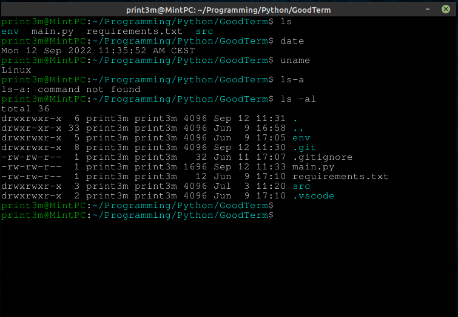

# GoodTerm - terminal emulator
The project has been created for fun and education. It's kinda special because of Python language which is not very popular in this type of "OS-related" projects. Python built-in library doesn't even have some of the necessary OS functions. I had to import them directly from the glibc. I used "PyGame" library to spawn a window and font rendering. Especially ability to disable parsing of control codes by the single flag is super cool. That's very interesting what programs send to control terminal behaviour.

### Features
* [x] Font rendering
* [x] Job control support
* [x] Ability to disable parsing of control codes
* [x] Some escape-codes
  * [x] Foreground colors
  * [x] Background colors
  * [x] Window title
* [ ] Scrolling
* [ ] Backspace
* [ ] Font size changing
* [ ] Cursor position and arrows support